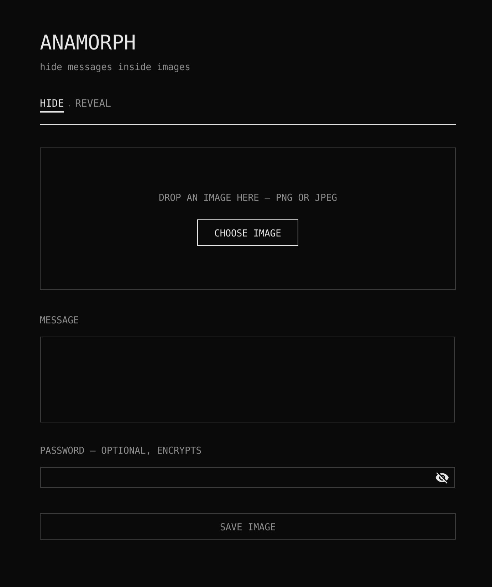

# anamorph


Hide encrypted messages inside ordinary images.

## What it is

A small desktop app. You give it an image and a message, it gives you back
a PNG that looks exactly the same but carries the message in its pixels.
Anyone with the PNG and the password can read the message. Without the
password, it is just a picture.

Everything is Go. Two dependencies: [Fyne](https://fyne.io) for the GUI
and [piv-go](https://github.com/go-piv/piv-go) to talk to a YubiKey. All
cryptography and image handling comes straight from the Go standard
library - no crypto packages, no image libraries, nothing else.

## Dependencies

- [Fyne](https://fyne.io) - the GUI toolkit
- [piv-go](https://github.com/go-piv/piv-go) - PIV smartcard access,
  used only for the YubiKey lock

That is the whole list. Everything else - AES, ECDH, HKDF, PBKDF2, PNG
and JPEG handling - is the Go standard library.

## How it works

- The message is encrypted with AES-256-GCM. The key comes from your
  password through PBKDF2-SHA256 with 600k iterations.
- The encrypted payload is written into the least significant bits of the
  image's R, G and B channels. The alpha channel is left alone.
- The result is saved as PNG, always. A lossy format like JPEG would
  destroy the hidden bits.
- A password is optional. Without one the message is still hidden and
  integrity-protected, just not secret.
- Instead of a password you can lock a message to a YubiKey. The app
  generates a P-256 key inside the YubiKey's PIV applet - it never leaves
  the hardware - and encrypts to its public half (ECDH plus HKDF-SHA256,
  same AES-256-GCM). Only that YubiKey can decrypt the image, and only
  with a physical touch: the key blinks and the message stays sealed until
  you tap it, so a lost or stolen key cannot silently open anything.
- Two YubiKeys can be paired: the app generates one shared key and
  writes it to both, so either key opens the same images. Pair once,
  hand one key to the other person, and you have a hardware-locked
  channel between you. During pairing the shared key briefly exists in
  the computer's memory - that is the price of having it on two cards.
- Every key the app creates carries a name like
  `anamorph pair 2026-07-19 3f9a1c`, stored in the slot's certificate,
  so the app - and `ykman piv info` - can always tell you where a key
  came from. Paired keys share the same name.

A 500×500 image holds about 93 KB of message. The GCM tag doubles as
wrong-password detection, so the app can tell you the password is wrong
instead of printing garbage.



## Download

Grab a prebuilt binary for your platform from the
[releases page](https://github.com/kczpl/anamorph/releases) - no Go
toolchain required. This is the easy way to hand a build to the other
person you paired a YubiKey with.

The builds are not signed by a paid developer certificate, so each
system warns once on first launch. That is expected; here is how to get
past it:

- **macOS**: right-click the app and choose **Open**, then **Open** again
  in the dialog - or run `xattr -cr anamorph.app` once. After that it
  launches normally.
- **Windows**: SmartScreen shows a blue banner. Click **More info**, then
  **Run anyway**.
- **Linux**: unpack the tarball and run the `anamorph` binary. The YubiKey
  lock needs PC/SC at runtime - install `libpcsclite` (Debian/Ubuntu:
  `libpcsclite1`) and start the `pcscd` service. The password lock works
  without it.

## Build from source

You need Go 1.26+ and, on macOS, the Xcode Command Line Tools
(`xcode-select --install`). Fyne uses cgo, so a C compiler is required
on every platform. YubiKey support talks PC/SC - built into macOS and
Windows; on Linux install `libpcsclite-dev` and run the `pcscd` service.

```sh
git clone https://github.com/kczpl/anamorph
cd anamorph
go run .
```

That's it. If you use [just](https://github.com/casey/just):

```sh
just setup     # one-time: installs the fyne CLI
just run       # run from source
just test      # go test ./... -race -cover
just build     # vet + test + package anamorph.app
just install   # build and install into /Applications (macOS)
```

`just package-mac` produces `dist/anamorph-macos.zip` with a universal
macOS build (Apple Silicon + Intel). The app is ad-hoc signed but not
notarized, so on first launch macOS will complain - either click
**Open Anyway** in System Settings → Privacy & Security, or run
`xattr -cr anamorph.app` once.

Windows and Linux builds work too, but have to be compiled on the target
OS (or with [fyne-cross](https://github.com/fyne-io/fyne-cross)), since
Fyne needs cgo.

## Usage

**Hide**: drop in a PNG or JPEG, type your message and pick a lock - a
password or a YubiKey. A new YubiKey offers a choice: set it up for this
computer alone, or pair two YubiKeys so two people can exchange images -
the app walks you through plugging in each key in turn. Save, and you
get a new PNG.

**Reveal**: drop in a PNG made by anamorph. The app tells you what it
needs - the password, or the right YubiKey in the port - and shows the
message.

## Code layout

- `internal/stego` - bits in, bits out. Hides a length-prefixed payload
  in the image and gets it back.
- `internal/crypt` - AES-256-GCM sealing and opening.
- `internal/vault` - glues the two together, normalizes any decoded
  image to a clean NRGBA canvas first.
- `internal/yubikey` - finds, creates or pairs anamorph keys on a
  plugged-in YubiKey and runs the one operation only hardware can: the
  ECDH half of decryption.
- `internal/ui` - the Fyne interface. `main.go` just calls `ui.Run()`.

## The name

From [anamorphosis](https://en.wikipedia.org/wiki/Anamorphosis) - a distorted
image that resolves into a clear picture only when viewed from the right
angle or through the right device. Same idea here: to everyone else it is
just a picture; look at it the right way - with the app and the password -
and the message appears.
